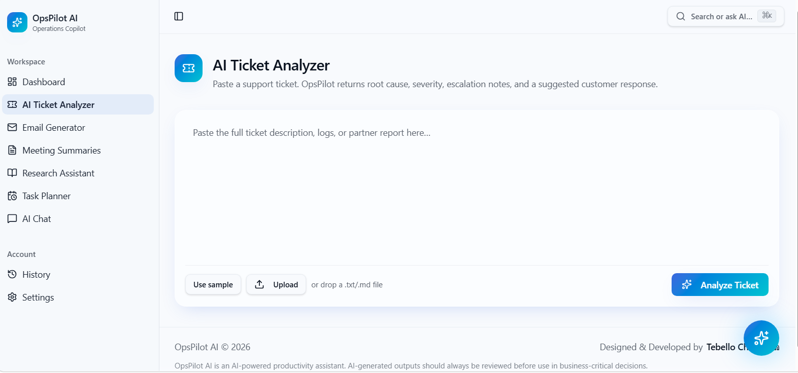
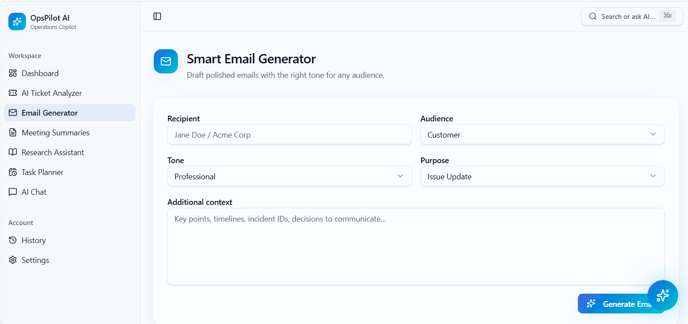
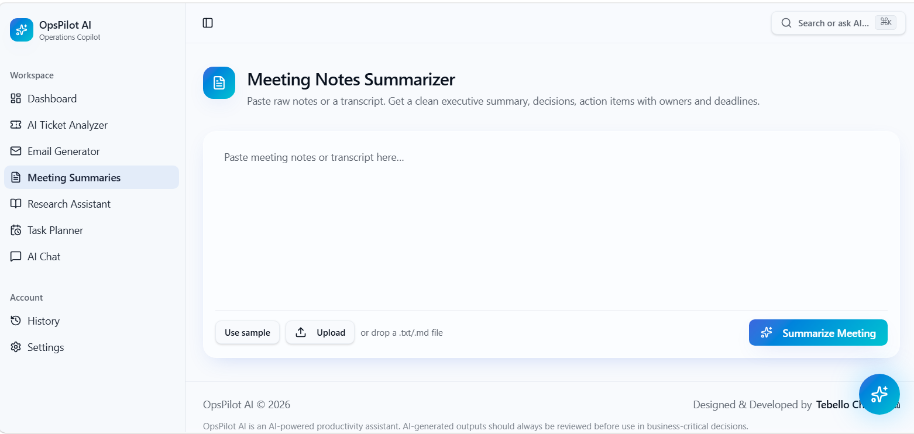
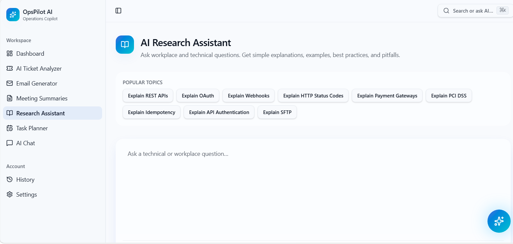
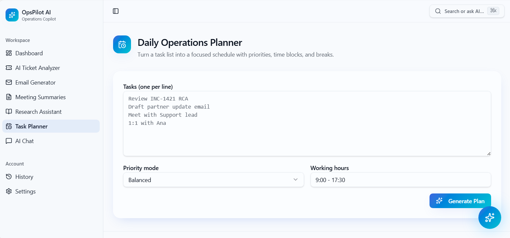
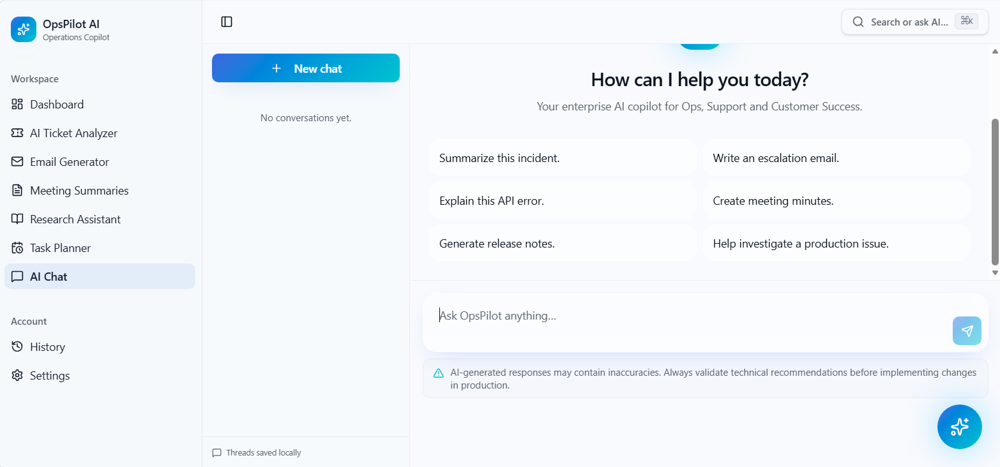
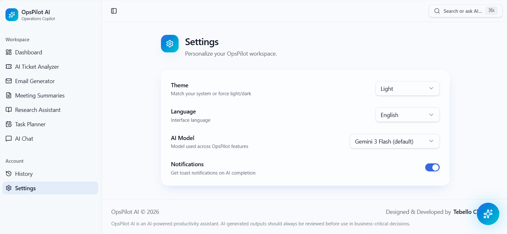

# 🤖 OpsPilot AI


> **AI-Powered Operations & Productivity Copilot**


OpsPilot AI is an AI-powered workplace assistant built to help Operations Specialists, Technical Support Engineers, Customer Success teams and Integration Engineers automate repetitive work such as ticket analysis, email drafting, meeting summarization, technical research and daily task planning.

## 🌐 Live Demo

👉 https://[YOUR-LOVABLE-URL](https://tebellochabeli-opspilot.lovable.app/)
---

# 📑 Table of Contents

- Project Overview
- Features
- Application Screenshots
- Tools Used
- Setup Instructions
- Folder Structure
- Responsible AI
- Future Improvements
- Developer

---

# 🚀 Project Overview

OpsPilot AI streamlines operational workflows by combining multiple AI-powered tools into a single modern SaaS application. It reduces manual effort, improves consistency, and enables faster decision-making through intelligent automation.

---

# ✨ Features

## 🎫 AI Ticket Analyzer
- Analyze support tickets
- Root cause analysis
- Severity assessment
- Escalation recommendations
- Customer response drafting

## 📧 Smart Email Generator
- Audience-based email generation
- Multiple professional tones
- Custom communication purposes

## 📝 Meeting Notes Summarizer
- Executive summaries
- Action items
- Decisions
- Risks
- Owners
- Deadlines

## 🔍 AI Research Assistant
- REST APIs
- OAuth
- Webhooks
- HTTP Status Codes
- Payment Gateways
- PCI DSS
- API Authentication
- SFTP
- Idempotency

## 📅 Daily Operations Planner
- Time blocking
- Priority planning
- Productivity recommendations

## 💬 AI Workplace Chat
- Incident investigation
- Documentation
- Technical Q&A
- Release notes
- Workplace assistance

---

# 📸 Application Screenshots

## Dashboard


## AI Ticket Analyzer



## Smart Email Generator



## Meeting Notes Summarizer



## AI Research Assistant



## Daily Operations Planner



## AI Workplace Chat



## Settings



---

# 🛠️ Tools Used

## Frontend
- React
- TypeScript
- Tailwind CSS
- shadcn/ui

## Backend
- Supabase

## AI
- OpenAI API / Gemini

## Development
- Lovable

---

# ⚙️ Setup Instructions

## Clone Repository

```bash
git clone https://github.com/YOUR_USERNAME/opspilot-ai.git
cd opspilot-ai
```

## Install

```bash
npm install
```

## Environment Variables

Create a `.env` file.

```env
VITE_SUPABASE_URL=YOUR_SUPABASE_URL
VITE_SUPABASE_ANON_KEY=YOUR_SUPABASE_ANON_KEY
VITE_OPENAI_API_KEY=YOUR_OPENAI_API_KEY
```

## Run

```bash
npm run dev
```

## Build

```bash
npm run build
```

---

# 📂 Folder Structure

```text
AI-Operations-Assistant
│
├── public
│     └──    dashboard.png
│            ticket-analyzer.png
│            email-generator.png
│            meeting-summaries.png
│            research-assistant.png
│            task-planner.png
│            ai-chat.png
│            settings.png
│          
│
```

---

# 🤖 Responsible AI

AI-generated responses may contain inaccuracies. Always validate AI output before making business-critical decisions.

---

# 🚀 Future Improvements

- Authentication
- Team workspaces
- AI analytics
- PDF exports
- Voice assistant
- Slack & Microsoft Teams integrations
- Jira integration
- API monitoring dashboard

---

# 👨‍💻 Developer

**Tebello Chabeli**

LinkedIn:
https://www.linkedin.com/in/tebello-chabeli-659b29206

---

## ⭐ License

Created as part of the **CAPACITI AI Skill Accelerator Programme** and intended for educational and portfolio purposes.
